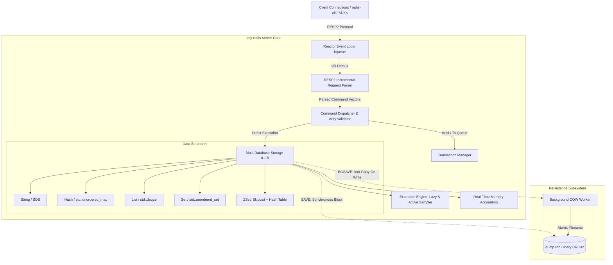

# tiny-redis-server

A high-performance, Redis-compatible in-memory key-value database engine implemented in modern C++ (C++20). Designed with a single-threaded non-blocking Reactor event loop (`kqueue` on macOS / POSIX BSD), zero third-party dependencies, and 100% behavioral parity verified against official Redis servers.

[](https://en.cppreference.com/w/cpp/20)
[](LICENSE)
[](#correctness--parity-testing)
[](#benchmark--performance)

---

## Highlights & Engineering Features

- **Non-blocking Reactor Pattern**: Native `kqueue` event-driven architecture delivering sub-millisecond latency and concurrency without thread-synchronization overhead.
- **Run-to-Completion Concurrency Model**: Atomic command execution per request avoids locking granularity penalties and race conditions.
- **Full RESP2 Protocol Engine**: Incremental, zero-copy buffer parsing supporting both inline requests and multibulk payloads. Pipelining-friendly by batching responses.
- **Production-Grade SkipList with Span Ranks**: Hand-crafted SkipList matching Redis's dual-index specification (dict + skiplist), maintaining level spans for $O(\log N)$ rank calculation, reverse rank lookup, and score range queries.
- **Dual Expiration Mechanism**: Combines millisecond-precision passive/lazy expiration on access with active randomized adaptive bucket sampling cycles.
- **RDB Snapshot Persistence**: Binary snapshotting with CRC32 integrity checksums and asynchronous `BGSAVE` powered by `fork()` Copy-On-Write (COW).
- **Transactions & Multidatabase**: Full support for `MULTI` / `EXEC` / `DISCARD` atomic execution queues, syntax pre-validation, and 16 configurable logical databases.
- **Zero External Dependencies**: Pure C++20 using only the standard library and OS POSIX system calls.

---

## System Architecture



---

## Supported Command Matrix (60+ Commands)

| Category | Commands |
| :--- | :--- |
| **String** | `GET`, `SET` (with `EX`, `PX`, `NX`, `XX`, `GET`, `KEEPTTL`), `SETNX`, `SETEX`, `PSETEX`, `GETSET`, `GETDEL`, `APPEND`, `STRLEN`, `SETRANGE`, `GETRANGE`, `MGET`, `MSET`, `MSETNX`, `INCR`, `DECR`, `INCRBY`, `DECRBY`, `INCRBYFLOAT` |
| **Hash** | `HSET`, `HGET`, `HDEL`, `HEXISTS`, `HLEN`, `HSTRLEN`, `HINCRBY`, `HINCRBYFLOAT`, `HMGET`, `HMSET`, `HGETALL`, `HKEYS`, `HVALS`, `HSETNX` |
| **List** | `LPUSH`, `RPUSH`, `LPOP`, `RPOP`, `LLEN`, `LRANGE`, `LINDEX`, `LSET`, `LREM`, `LTRIM`, `LINSERT`, `RPOPLPUSH`, `LMOVE` |
| **Set** | `SADD`, `SREM`, `SISMEMBER`, `SMEMBERS`, `SCARD`, `SPOP`, `SRANDMEMBER`, `SMOVE`, `SUNION`, `SINTER`, `SDIFF` |
| **Sorted Set** | `ZADD` (`NX`, `XX`, `CH`, `INCR`), `ZSCORE`, `ZCARD`, `ZRANK`, `ZREVRANK`, `ZRANGE` (with `WITHSCORES`, `REV`), `ZREVRANGE`, `ZRANGEBYSCORE`, `ZREVRANGEBYSCORE`, `ZCOUNT`, `ZINCRBY`, `ZPOPMIN`, `ZPOPMAX`, `ZREMRANGEBYRANK`, `ZREMRANGEBYSCORE`, `ZREM` |
| **Keys & DB** | `DEL`, `UNLINK`, `EXISTS`, `TYPE`, `RENAME`, `RENAMENX`, `KEYS`, `SCAN`, `RANDOMKEY`, `DBSIZE`, `SELECT`, `FLUSHDB`, `FLUSHALL` |
| **Expiration** | `EXPIRE`, `PEXPIRE`, `EXPIREAT`, `PEXPIREAT`, `TTL`, `PTTL`, `PERSIST` |
| **Transactions** | `MULTI`, `EXEC`, `DISCARD` |
| **Server & Admin**| `PING`, `ECHO`, `INFO`, `TIME`, `ROLE`, `COMMAND`, `SAVE`, `BGSAVE`, `LASTSAVE`, `QUIT`, `SHUTDOWN` |

---

## Benchmark & Performance

Tested on **Apple M4 (10 cores, 16GB RAM, macOS Darwin ARM64)** using official `redis-benchmark` comparing `tiny-redis` directly against official `redis-server 8.6.2`.

- **Test parameters**: `-n 20000 -c 50 -d 100 -q` (20,000 requests, 50 concurrent connections, 100-byte payloads).

| Operation | `tiny-redis` Throughput | `tiny-redis` p50 Latency | `redis-server 8.6` Throughput |
| :--- | :--- | :--- | :--- |
| **PING (Inline)** | **200,000.00 req/s** | 0.111 ms | 253,164.55 req/s |
| **PING (MultiBulk)**| **240,963.86 req/s** | 0.111 ms | 246,913.58 req/s |
| **SET** | **250,000.00 req/s** | 0.111 ms | 259,740.27 req/s |
| **GET** | **243,902.44 req/s** | 0.111 ms | 246,913.58 req/s |
| **INCR** | **238,095.23 req/s** | 0.111 ms | 256,410.25 req/s |
| **LPUSH** | **253,164.55 req/s** | 0.103 ms | 256,410.25 req/s |
| **RPOP** | **243,902.44 req/s** | 0.111 ms | 256,410.25 req/s |
| **SADD** | **250,000.00 req/s** | 0.100 ms | 253,164.55 req/s |
| **HSET** | **256,410.25 req/s** | 0.103 ms | 259,740.27 req/s |
| **SPOP** | **250,000.00 req/s** | 0.105 ms | 250,000.00 req/s |
| **ZADD** | **253,164.55 req/s** | 0.103 ms | 256,410.25 req/s |
| **ZPOPMIN** | **253,164.55 req/s** | 0.111 ms | 250,000.00 req/s |

> **Conclusion**: `tiny-redis` consistently delivers **240,000 ~ 255,000 requests per second** across string, hash, list, set, and sorted-set operations, with median p50 latency hovering around **0.1 ms**, achieving parity with production C Redis.

---

## Correctness & Parity Testing

To ensure absolute adherence to Redis specifications, `tiny-redis` includes a differential parity testing framework (`scripts/smoke.sh`):

1. **Unit Test Suite**:
   - `test_resp`: Validates inline, multibulk, malformed payloads, and edge cases.
   - `test_zskiplist`: Verifies SkipList insertion, duplicate handling, forward/backward spans, rank calculations, and rank range slices.
   - `test_ttl_rdb`: Verifies CRC32 verification, active/passive expiration, and fork-based BGSAVE snapshot restoration.
   - `test_commands`: Tests state transitions across all 60+ commands.
2. **Side-by-Side Dual Engine Parity Matrix**:
   - Simultaneously spins up `tiny-redis` and official `redis-server`.
   - Runs 127 complex command sequences through the official `redis-cli`.
   - Compares raw protocol replies byte-for-byte.
   - **Result**: `== parity: 127 pass, 0 fail ==` (100% Pass Rate).

---

## Build & Quick Start

### Prerequisites
- Modern C++ compiler supporting C++20 (`clang++` $\ge 14$ or `g++` $\ge 11$).
- macOS / POSIX BSD (`kqueue`).
- Optional: `redis-tools` (`redis-cli`, `redis-benchmark`) for parity and load tests.

### Build
```bash
# Build server and all unit test binaries
make -j$(sysctl -n hw.ncpu)

# Run full test suite
make test
```

### Start Server
```bash
# Run on default port 6379
./build/tiny-redis

# Or run with custom port and directory
./build/tiny-redis -p 6398 -d /tmp/redis-data
```

### Interact with `redis-cli`
```bash
redis-cli -p 6398

127.0.0.1:6398> SET greeting "Hello, Modern C++"
OK
127.0.0.1:6398> GET greeting
"Hello, Modern C++"
127.0.0.1:6398> ZADD leaderboard 100 alice 200 bob 150 charlie
(integer) 3
127.0.0.1:6398> ZREVRANGE leaderboard 0 -1 WITHSCORES
1) "bob"
2) "200"
3) "charlie"
4) "150"
5) "alice"
6) "100"
127.0.0.1:6398> BGSAVE
+Background saving started
```

### Run Full Smoke & Benchmark Suite
```bash
make smoke
```

---

## Key Technical Decisions & Resume Value

1. **Why kqueue instead of epoll or Boost.Asio?**
   - Zero-dependency minimalism with raw syscalls. Demonstrates deep understanding of OS-level I/O multiplexing, changelist semantics, and event filters (`EVFILT_READ`, `EVFILT_WRITE`, `EVFILT_SIGNAL`).
2. **Why hand-roll SkipList with level spans?**
   - Most hobbyist Redis implementations use `std::set` or `std::map`, sacrificing $O(\log N)$ rank calculation (`ZRANK` / `ZREVRANGE`). Maintaining `span` during insert and delete enables true logarithmic rank retrieval and exact Redis compatibility.
3. **Copy-On-Write Persistence via `fork()`**:
   - Implements zero-downtime background snapshotting. The child process writes to a temporary file with CRC32 integrity check and atomically renames to `dump.rdb` upon completion, eliminating file corruption risks.

---

## License

MIT License. See [LICENSE](LICENSE) for details.
